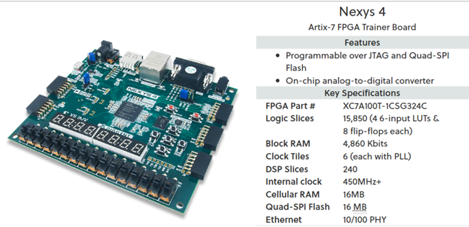
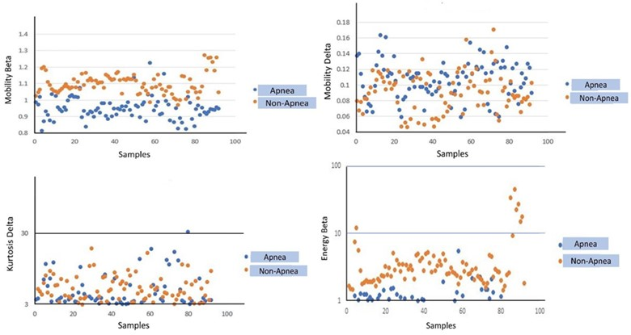
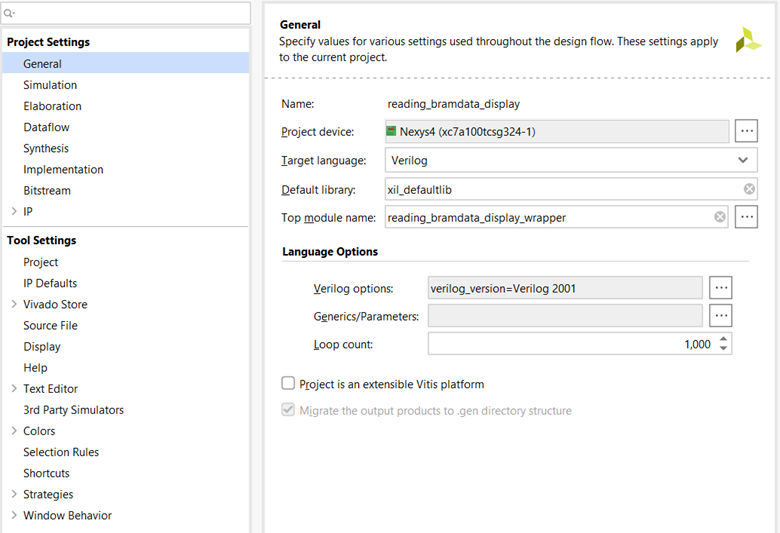
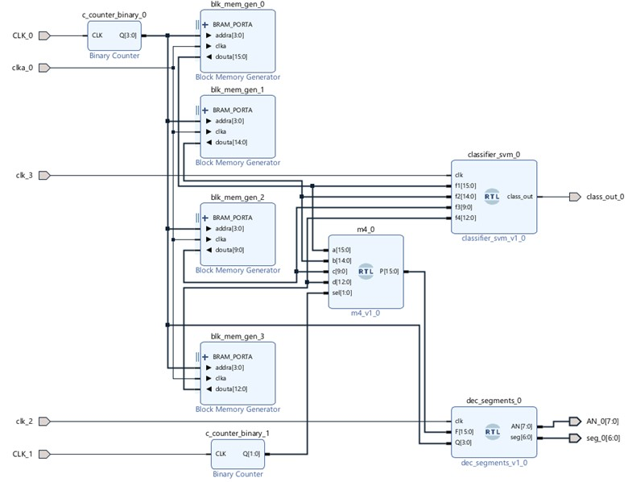
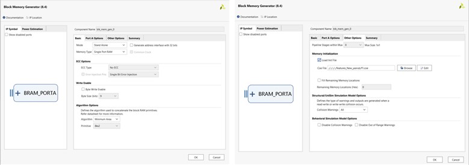
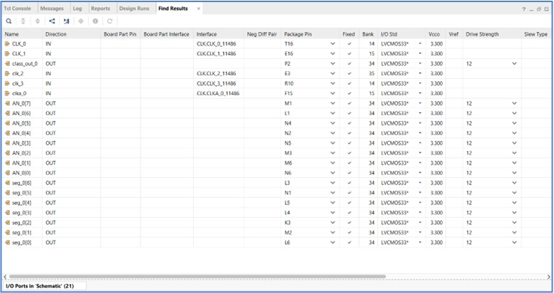
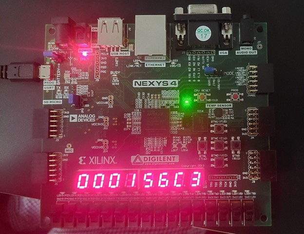

# FPGA-Based Sleep Apnea Detection System

## Team Name: 
Team Sleep_Apnea

## Team Members:
- Mehedi Hasan
- Rumali Siddiqua
- Alexander Osei-Bonsu

## Project Description

Sleep apnea is a prevalent sleep disorder characterized by interruptions in breathing during sleep, significantly affecting overall health and quality of life. Traditional methods of apnea detection often rely on software-intensive approaches, which are computationally expensive and unsuitable for real-time, portable applications. The project focuses on developing a hardware system for real-time detection of sleep apnea using EEG signals. By leveraging specific EEG signal features and a Linear Support Vector Machine (LSVM) classifier, the system aims to provide high accuracy, sensitivity, and specificity.

## Key Objectives:
- Develop software model for Sleep Apnea Detection
- Implement the software model in Nexys 4 FPGA board
- Achieve high performance in terms of Accuracy, Sensitivity and Specificity

## Technology Stack:
Hardware: NEXYS 4 Equipped with Xilinx Artix-7 FPGA

Software Tools: MATLAB, Xilinx Vivado Design Suite

Classifier: Linear Support Vector Machine (LSVM)

Data Source: [St. Vincent’s UCDDB PhysioNet EEG database](https://physionet.org/content/ucddb/1.0.0/)

Fig. 1. Nexys 4 ™ FPGA board and its specifications

## Workflow of the Project

The overall system workflow is divided into three main stages: (1) data collection and preprocessing, (2) software-based model development and training, and (3) hardware implementation and testing. The first stage involves acquiring raw EEG signals and preparing them for feature extraction. The second stage develops a robust machine learning model to classify apnea events using extracted features. Finally, the third stage implements the trained model on an FPGA platform for real-time detection. Overall workflow of the project is shown in Fig. 2.

Fig. 2. Project development workflow

## Software: Model Development and Training

## Data Collection
The dataset used for this project is derived from the PhysioNet St. Vincent’s Sleep Apnea Database (UCDDB). The dataset includes EEG recordings from two channels: C3-A2 and C4-A1, which are processed as time-averaged signals. These recordings are labeled to distinguish between apnea and non-apnea events, making them suitable for supervised learning models. 

## Data Preprocessing
The raw signals often contain noise and artifacts originating from various sources, such as eye movements, eye blinks, sweating, and body movements. To address this, a preprocessing pipeline is employed that includes filtering and band decomposition. A Butterworth band pass filter is specifically employed at the input of the EEG signal to exclusively address the baseline artefact. Filters remove high-frequency noise and unwanted artifacts, while band decomposition isolates specific EEG frequency bands (Delta, Theta, Alpha, Beta) known to correlate with sleep apnea events. By isolating these frequency bands, more distinct features can be extracted compared to analyzing the entire EEG signal, thus enhancing classification accuracy.
The preprocessing step ensures that the EEG signals are clean, artifact-free, and segmented into meaningful frequency bands. Preprocessing is implemented in MATLAB. 

## Feature Extraction
Feature extraction is a crucial step where meaningful characteristics are derived from the filtered and decomposed EEG signals. The Kruskal-Walli’s test is employed to rank features and determine their relevance to sleep apnea. Ultimately, the four top-ranked features, namely energy beta, kurtosis delta, mobility delta, and mobility beta, are chosen as inputs to the subsequent classifier block. Fig. 3 presents the graphical representation of the feature vectors belonging to the apnea and non-apnea class. As it can be inferred from the plot the features are not much overlapping. 

Fig. 3. Features for apnea and non-apnea events 

 
 
  
The preprocessed EEG signals undergo feature extraction to derive key attributes (F1, F2, F3, F4) that are critical for apnea classification. These features include metrics such as signal amplitude, frequency domain characteristics, and entropy, which are ranked using statistical methods to identify the most informative ones. 

## ML Classifier Selection 
Six basic classifiers are selected to differentiate apnea from non-apnea incidents. The classifiers used were Ensemble (Bagged Trees), Ensemble (Subspace Discriminant), Linear SVM, SVM (Medium Gaussian), and Weighted K-nearest Neighbor. Among them, Linear SVM demonstrated the best performance in terms of accuracy, sensitivity, and specificity (Table 1).

Table 1. Classifier Performance

| No. | Classifier | Accuracy (%) | Sensitivity (%) | Specificity (%) |
|------------------|-----------------|------------------|------------------|------------------|
| 1      | Ensemble (Bagged Trees)    | 93.58     | 92.42     | 91.42     |
| 2    | Linear SVM    | 94.81     | 93.10     | 96.43     |
| 3     | Ensemble (subspace discriminant)    | 93.38     | 90.44     | 94.24      |
| 4     | SVM (Medium Gaussian)    | 93.64     | 90.56     | 89.82     |
| 5     | Weighted KNN     | 93.28     | 89.80     | 89.40     |
| 6     | ANN    | 93.88     | 92.5     | 95.56     |

## LSVM Classifier
The core of the model development process is the Support Vector Machine (SVM) Classifier. The features are then fed into a Support Vector Machine (SVM) classifier, which is trained to distinguish between apnea and non-apnea events. The training process involves using labeled datasets with a diverse set of EEG recordings, ensuring robust model performance. 

In this project, 80% of the collected EEG data was allocated for the training phase, while the remaining 20% was reserved for testing, ensuring data separation for robust model evaluation. During the testing phase, the EEG feature set was classified into two categories: apnea and non-apnea. Cross-validation is employed to prevent overfitting and to validate the classifier’s accuracy. This involved computing metrics such as accuracy, sensitivity, and specificity for individual subjects. 

Once the model is optimized, its parameters, including weights and decision boundaries, are exported for hardware implementation. The software stage ensures the model achieves high accuracy and reliability before transitioning to hardware. The model is developed and trained in MATLAB. The MATLAB code file is located in the [MATLAB Code](./MATLAB%20Code/)
folder of the repository. 

We need to open MATLAB, click on the Apps section, navigate towards the Machine Learning and Deep Learning sub-section, and select Classifier Learner. A window as shown in Fig. 4 will pop-up. In this window, we can create a new session, upload data files, perform model training, get trained models, and conduct testing.

Fig. 4. MATLAB Classifier Window

## Exporting Trained Model Parameters
Once the SVM classifier is trained and validated, the key parameters (support vectors, coefficients, and biases) are exported. These parameters are later used in the hardware implementation stage to replicate the classification logic on FPGA hardware. 

## Hardware: Implementation and Testing
The hardware implementation translates the software-based model into an FPGA-compatible design. This stage consists of two main blocks: the Feature Extractor Block and the Trained Classifier Block.

 
Fig. 5. Hardware Implementation

## Trained Classifier Block
The trained parameters from the SVM model exported during the software development phase are integrated into this block. The classifier uses the extracted features (F1, F2, F3, F4) to perform binary classification, identifying whether an event is apnea (1) or non-apnea (0). The hardware implementation ensures that the classifier operates with the same accuracy and efficiency as its software counterpart.

## FPGA Implementation Process
The hardware system is implemented on NEXYS 4 Equipped with Xilinx Artix-7 FPGA, chosen for its flexibility, low power consumption, and suitability for real-time processing. The design is implemented using Verilog HDL ensuring a precise and efficient representation of the system logic. All Verilog HDL code files are located in the [Hardware Design Files](./Hardware%20Design%20Files/)
 folder of the repository. 

For hardware setup, at first we need to open a Project in Xilinx Vivado. We need to set the target FPGA board (Nexys 4) at this stage, as shown in Fig. 6. The top module for the project is the file named as reading_bramdata_display_wrapper. 

Fig. 6. Vivado project creation

 
 

Schematic of the implemented design in Xilinx Vivado is shown in Fig. 7. From the schematic, it can be seen that 4 IP block RAMs have been used, followed by the RTL modules. One of the module is for LSVM classifier, another module is for output display in the Seven Segment Display. The objective of the counter is to shift the pointer from one data recordent to the subsequent one.

Fig.7. Vivado Schematic

 
 

Configuration to the Block RAM IP is depicted using Fig. 8. To attach the Input Data file, we need to navigate to the “Other Option”, and browse the Data File, as shown in Fig. 8.

Fig.8. Block RAM IP configuration

 
 

Finally, we need to define the IO pins in Vivado for the Nexys 4 FPGA board. Information regarding the pins can be found in the Nexys 4 FPGA board’s reference manual. Using the reference, the designated IO pins set for the project is shown in Fig. 9.

Fig.9. Package Pin Configuration

 
 

Finally, once everything is set up, we need to connect the FPGA board with our PC through USB cable, as shown in Fig.10,  we need to click on Run Simulation>Run Synthesis>Run Implementation>Generate Bitstream. Once the Bitstream has been generated, we need to click on Open Target>Program Device from the “Open Hardware Manager” section. This will program the FPGA board based on our design.

## Classifier Output Testing Using FPGA
After programming the device, we have verified the Sleep Apnea classification by using the FPGA board. To verify our design, we have configured the T16 push button in the FPGA to provide input to an incremental counter. Once we push the T16 button, the counter will increment its value to navigate from one data recording to its subsequent one. Then, we need to press the F15 button of the FPGA board to send the extracted feature value for the given recording to the SVM classifier block. To view the extracted feature values for a given recording, we need to press the E16 button. This will display the 1st extracted feature value in Hexadecimal format. Pressing it again will display the 2nd extracted feature. Pressing E16 for 3rd and 4th time will display the 3rd and 4th extracted feature value. Finally, to know the class of a given recording, we need to press the R10 push button, which will enable the SVM classifier block. Output can be displayed in the LD15 LED of the Nexys 4 board. If the LED lights up, the predicted output belongs to a Sleep Apnea class (as shown in Figure 10). Otherwise, the LED will be off if the predicted outcome of the SVM classifier belongs to a non-sleep apnea class.  

Fig.10. FPGA output testing

## Results (Software and Hardware)
Results obtained from software and hardware implementation are shown in Table 2. From the results, we can see that there is a performance difference between software and FPGA implemented results. In MATLAB testing, we can consider fraction values of weights, bias and feature data. However, for FPGA implementation, we were only sending the integer values, truncating the fractional parts of the weights, bias and feature data. Due to this reason, we are missing some information of the trained parameters while doing FPGA implementation. This is the main reason behind the slight decrease in performance parameters from the FPGA output.

Table 2. Performance of the implemented design
<table>
  <tr>
    <th colspan="2">Accuracy (%)</th>
  </tr>
  <tr>
    <td>MATLAB</td>
    <td>FPGA</td>
  </tr>
  <tr>
    <td>94.81</td>
    <td>91.13</td>
  </tr>
</table>

<table>
  <tr>
    <th colspan="2">Sensitivity (%)</th>
  </tr>
  <tr>
    <td>MATLAB</td>
    <td>FPGA</td>
  </tr>
  <tr>
    <td>93.10</td>
    <td>86.24</td>
  </tr>
</table>

<table>
  <tr>
    <th colspan="2">Specificity (%)</th>
  </tr>
  <tr>
    <td>MATLAB</td>
    <td>FPGA</td>
  </tr>
  <tr>
    <td>96.43</td>
    <td>96.2</td>
  </tr>
</table>

## Conclusion and Future Work
The main objective of Sleep Apnea detection has been achieved successfully both in terms of software and hardware implementation. Obtained results from Software and Hardware parts are promising. Future work on this project can be figuring out more robust models for data training, in order to achieve better accuracy. Moreover, further work needs to be done to reduce the performance gap between software and hardware counterparts.

Demo Video [Link](https://drive.google.com/file/d/1rYNZqFusiaxiN44hcKOw3OOo-nI2DZbX/view?usp=sharing)

