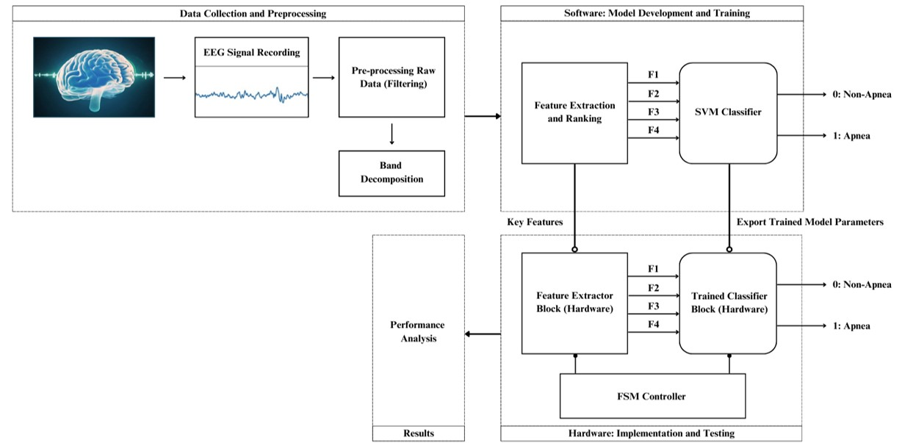
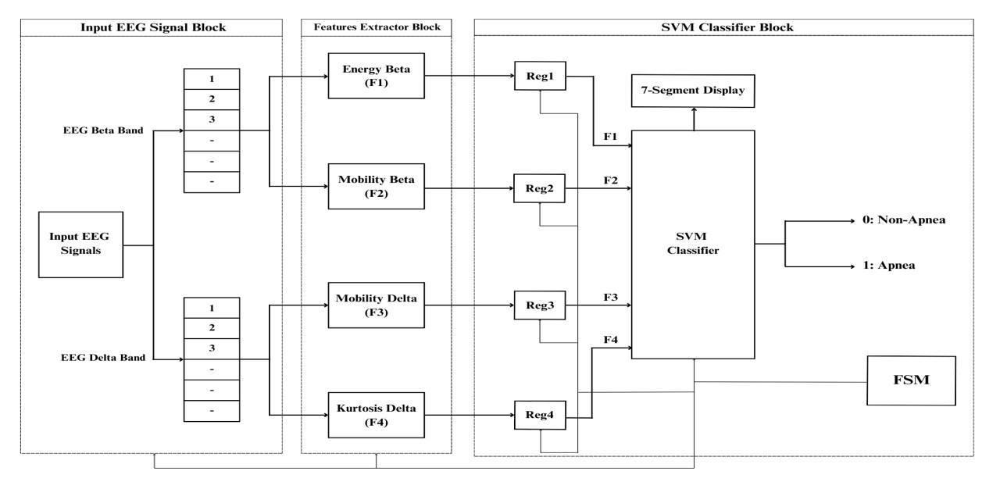

## Introduction

Sleep apnea is a prevalent sleep disorder characterized by interruptions in breathing during sleep, significantly affecting overall health and quality of life. Traditional methods of apnea detection often rely on software-intensive approaches, which are computationally expensive and unsuitable for real-time, portable applications. By leveraging the low-power and high-speed capabilities of FPGA hardware, this project aims to create a real-time solution for sleep apnea detection.

The overall system workflow is divided into three main stages: (1) data collection and preprocessing, (2) software-based model development and training, and (3) hardware implementation and testing. The first stage involves acquiring raw EEG signals and preparing them for feature extraction. The second stage develops a robust machine learning model to classify apnea events using extracted features. Finally, the third stage implements the trained model on an FPGA platform for real-time detection. 

## Data Collection and Preprocessing:
The dataset used for this project is derived from the PhysioNet St. Vincent’s Sleep Apnea Database (UCDDB). The dataset includes EEG recordings from two channels: C3-A2 and C4-A1, which are processed as time-averaged signals. These recordings are labeled to distinguish between apnea and non-apnea events, making them suitable for supervised learning models. 
The process begins with EEG signal acquisition using a multi-channel EEG device, where the signals represent brain activity during sleep. These signals are characterized by a high sampling rate. The raw signals often contain noise and artifacts originating from various sources, such as eye movements, eye blinks, sweating, and body movements. To address this, a preprocessing pipeline is employed that includes filtering and band decomposition. A Butterworth band pass filter is specifically employed at the input of the EEG signal to exclusively address the baseline artefact. Filters remove high-frequency noise and unwanted artifacts, while band decomposition isolates specific EEG frequency bands (Delta, Theta, Alpha, Beta) known to correlate with sleep apnea events. By isolating these frequency bands, more distinct features can be extracted compared to analyzing the entire EEG signal, thus enhancing classification accuracy.
The preprocessing step ensures that the EEG signals are clean, artifact-free, and segmented into meaningful frequency bands. Preprocessing is implemented in MATLAB. 

## Software: Model Development and Training

## Feature Extraction and Ranking
Feature extraction is a crucial step where meaningful characteristics are derived from the filtered and decomposed EEG signals. The following features are computed from the five EEG frequency bands (Delta, Theta, Alpha, Sigma, and Beta):

- Energy: Represents the signal's power within each frequency band.
- Kurtosis: Captures the sharpness or "peakedness" of the EEG waveforms.
- Mobility: Measures the variability in signal amplitude over time.
The preprocessed EEG signals undergo feature extraction to derive key attributes (F1, F2, F3, F4) that are critical for apnea classification. These features include metrics such as signal amplitude, frequency domain characteristics, and entropy, which are ranked using statistical methods to identify the most informative ones. 

## Classification 
Six basic classifiers are selected to differentiate apnea from non-apnea incidents. The classifiers used were Ensemble (Bagged Trees), Ensemble (Subspace Discriminant), Linear SVM, SVM (Medium Gaussian), and Weighted K-nearest Neighbor. Among them, Linear SVM demonstrated the best performance in terms of accuracy, sensitivity, and specificity. Linear SVM is particularly suited for linearly separable datasets, and it operates effectively for both classification and regression analysis, with its performance heavily reliant on the weight and bias parameters that define the hyperplane's position and orientation.

## SVM Classifier
The core of the model development process is the Support Vector Machine (SVM) Classifier. The features are then fed into a Support Vector Machine (SVM) classifier, which is trained to distinguish between apnea and non-apnea events. The training process involves using labeled datasets with a diverse set of EEG recordings, ensuring robust model performance. 
In this project, 80% of the collected EEG data was allocated for the training phase, while the remaining 20% was reserved for testing, ensuring data separation for robust model evaluation. During the testing phase, the EEG feature set was classified into two categories: apnea and non-apnea. Cross-validation is employed to prevent overfitting and to validate the classifier’s accuracy. This involved computing metrics such as accuracy, sensitivity, and specificity for individual subjects. 
Once the model is optimized, its parameters, including weights and decision boundaries, are exported for hardware implementation. The software stage ensures the model achieves high accuracy and reliability before transitioning to hardware. The model is developed and trained in MATLAB due to its comprehensive signal processing and machine learning libraries. 

## Exporting Trained Model Parameters
Once the SVM classifier is trained and validated, the key parameters (support vectors, coefficients, and biases) are exported. These parameters are later used in the hardware implementation stage to replicate the classification logic on FPGA hardware. 

## Hardware: Implementation and Testing
The hardware implementation translates the software-based model into an FPGA-compatible design. This stage consists of two main blocks: the Feature Extractor Block and the Trained Classifier Block.

## Feature Extractor Block
The Feature Extractor Block processes the preprocessed EEG signals to compute the key features (F1, F2, F3, F4) in real-time. This block is responsible for replicating the feature extraction logic used in the software model. The FPGA is programmed to calculate features like energy, kurtosis, and mobility from the input EEG signals. These features are then passed to the Trained Classifier Block, which implements the SVM model using the exported parameters. 

## Trained Classifier Block
The trained parameters from the SVM model exported during the software development phase are integrated into this block. The classifier uses the extracted features (F1, F2, F3, F4) to perform binary classification, identifying whether an event is apnea (1) or non-apnea (0). The hardware implementation ensures that the classifier operates with the same accuracy and efficiency as its software counterpart.

## Finite State Machine (FSM) Controller
To manage the data flow and processing states, a Finite State Machine (FSM) controller is employed. It coordinates the operations of the feature extractor and classifier, ensuring efficient execution. 

## FPGA Implementation
The hardware system is implemented on NEXYS 4 Equipped with Xilinx Artix-7 FPGA, chosen for its flexibility, low power consumption, and suitability for real-time processing. The design is implemented using Verilog HDL ensuring a precise and efficient representation of the system logic. 

## Testing
The preprocessed EEG signals from the dataset are fed into the FPGA to test the system. The hardware output (apnea or non-apnea) is compared with the ground truth labels from the dataset to validate its accuracy. 

## Performance Analysis
The system's performance was evaluated using accuracy, sensitivity, and specificity metrics. These metrics were computed for individual subjects and across subjects to ensure the system's reliability and robustness.

## Hardware Setup Steps:

