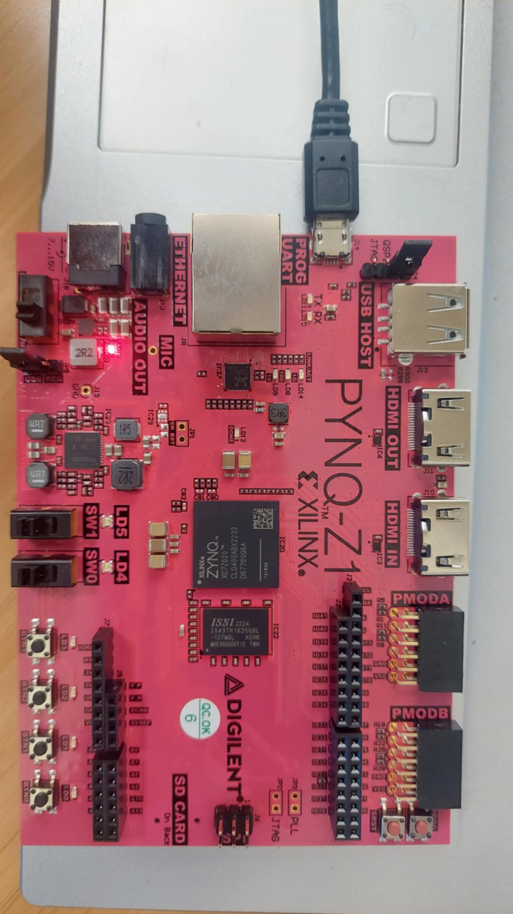

## EEG Data

The MATLAB code is designed to analyze EEG data to detect sleep apnea episodes. It begins by reading an EDF file containing EEG signals from a specific subject and extracting data from two channels, C3A2 and C4A1. These channels are combined through averaging to create a single signal for further analysis. The preprocessing phase involves applying a Butterworth bandpass filter to isolate frequency bands commonly associated with sleep stages: delta, theta, alpha, sigma, and beta. The code then segments the EEG data into normal and apnea periods based on the start and end times provided in an associated Excel file. This segmentation allows for targeted analysis of specific signal intervals.

For feature extraction, the code computes various statistical and signal-based parameters, including energy, kurtosis, skewness, interquartile range (IQR), activity, mobility, mean absolute deviation (MAD), and complexity. These features are calculated separately for normal and apnea segments across all frequency bands, capturing the distinct characteristics of the EEG signals during different states. The extracted features are organized into matrices, which serve as inputs for further analysis or machine learning models.

The code also includes a quantization step to prepare the EEG signals for compatibility with hardware implementation or low-precision processing. Finally, processed signals and feature data for delta and beta bands are saved into text files, enabling further analysis. This comprehensive approach, combining signal processing, feature extraction, and data organization, supports the detection and classification of sleep apnea episodes based on EEG data.

## SVM Classifier Implementation

This project involves the implementation of a hardware-based Support Vector Machine (SVM) classifier using Verilog. The classifier is designed to process four signed input features of varying bit-widths and classify them into binary classes based on a predefined decision boundary. The architecture employs a modular design, integrating multipliers, adders, and a comparator to compute the SVM's decision function. The input features are multiplied by their respective weights, which are parameterized to define the SVM hyperplane. These weighted products are then summed using a cascade of adders, and a bias term is added to the result to compute the final decision function. The computed value is fed into a comparator, which evaluates its sign to determine the binary class label (1 for positive and 0 for negative).

## Hardware Setup Trial

The first problem that we encountered with Vivado was to use the IP block RAM. We tried implementing a design created in the Vivado 2018 version into the Vivado 2023 version. In case we need to transfer from one version to another, we need to update/upgrade the IP blocks to the latest version. We need to follow the UPDATE procedures in the Vivado window.

We also tried setting up our initial hardware configuration with the PYNQ Z1 board, but it did not work out. Later, we realized that we needed to insert the BOARD FILES for the PYNZ-Z1 board in the location /data/boards/board_files. Vivado BOARD FILES for Digilent FPGA boards can be found at: https://github.com/Digilent/vivado-boards 

Also, we did not update the Pin configuration properly by looking into the PYNQ-Z1 board’s reference manual (https://digilent.com/reference/programmable-logic/pynq-z1/reference-manual ).

As we were informed that the NEXYS-4 board is available, we actually did not solve the issues related to the PYNZ-Z1 setup and implementation. 

